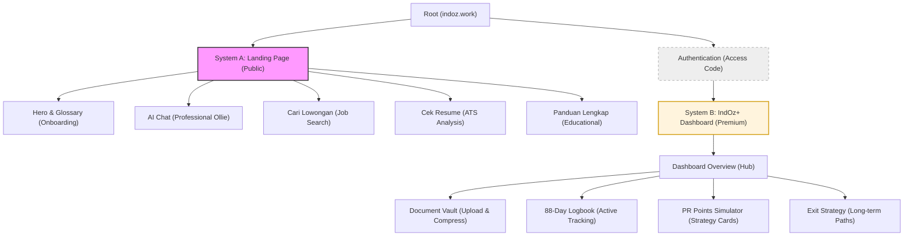

# Reconstruction Plan: indoz.work (Improved UX Edition)

Following a detailed critique of the current implementation, this plan outlines a complete overhaul focused on **clarity, structural separation, and professional value**.

---

## 1. UX Strategy & Information Architecture

### 1.1 Clarity First (Onboarding)
*   **The Problem:** Users jump straight into AI chat without knowing what WHV, SDUWHV, or 88 Days mean.
*   **The Fix:** 
    *   **Hero Section:** Clearly define the mission: "Gerbang Karir & Residensial Australia untuk Indonesia."
    *   **Glossary Component:** A subtle "Daftar Istilah" or hover-tooltips for WHV (Working Holiday Visa), SDUWHV (Surat Dukungan WHV), and PR (Permanent Residency).
    *   **Educational Landing:** Before the tools, present a "3-Step Journey" (Persiapan → Keberangkatan → Menetap).

### 1.2 System Separation
*   **System A: Landing Page (Public):** Focus on information discovery, job search, and AI initial guidance.
*   **System B: IndOz+ Dashboard (Premium):** A dedicated, distinct portal for logged-in users. No more overlapping "tabs-within-tabs" from the landing page.

---

## 2. Integrated Feature Specifications

### 2.1 Topbar & Navigation (Refactored)
*   **Flattened Menu:** Remove the "Tools & Guides" dropdown. Display the 4 primary features directly: **AI Chat**, **Cari Lowongan**, **Cek Resume**, and **Panduan**.
*   **Logo UX:** Remove the "🇮🇩" flag to avoid confusion with language switchers. Use a clean, modern "IndOz" wordmark.
*   **Breadcrumbs:** Remove breadcrumbs for 1-level deep pages. Use a "Back to Home" link or rely on the logo.
*   **Consistently Active States:** Use a distinct underline or background highlight for the active menu item.

### 2.2 AI Career Assistant (Ollie 2.0)
*   **Tone Shift:** Move from "gaul/slang" to a **professional yet friendly** Indonesian. Avoid cringe-worthy slang while remaining accessible.
*   **Contextual Greeting:** "Selamat datang di IndOz. Saya Ollie, asisten karir Anda. Apakah Anda sedang mempersiapkan WHV atau merencanakan PR?"
*   **Menu Overhaul:** Separate the AI chat from the "Big Button" menu. Use a structured container for the chat interface to avoid overlapping UI elements.

### 2.3 Job Search & Resume Analysis
*   **Accessibility Fixes:** Ensure all form text (especially in the Career Consultation/Contact forms) has high contrast (prevent white-on-white text).
*   **Feedback Modal:** The "Submit" button should remain clickable but trigger **inline validation messages** (e.g., "Mohon pilih rating bintang dahulu") if clicked while empty.

---

## 3. Premium Dashboard (IndOz+)
*   **Dedicated Overview:** The dashboard should be a "Hub" showing a snapshot of all premium modules (Progress bar for documents, current PR points, next logbook entry).

### 3.1 Advanced Document Vault
*   **Active Management:** Not just a checklist. Users can **upload** documents.
*   **System Logic:** Automatically validate file types and **auto-compress** PDFs to <2MB for the "War SDUWHV".
*   **Gamification:** When the checklist hits 8/8, trigger a "Ready for War!" state with a green progress bar and a "Download Package" button.

### 3.2 88-Day Logbook (Active Use)
*   **Context:** Clearly label this as a tool for those *already in Australia* working on their visa extension.
*   **UI Fix:** Change the "darkmode field" to a structured log entry table.
*   **Instructions:** Provide clear guidance: "Catat setiap hari kerja untuk memastikan Anda memenuhi syarat perpanjangan visa."

### 3.3 PR Points Simulator (Clear Output)
*   **Initial State:** All fields blank/unselected to force user accuracy.
*   **Contextual Help:** Add info icons next to "189" and "190" to explain visa subclasses.
*   **Actionable Results:** Instead of just a score, provide a **Strategy Card**:
    *   *If Points < 65:* "Prioritaskan tes bahasa Inggris Superior atau cari State Nomination."
    *   *If "Eligible but needs strategy":* Highlight the specific weak points (e.g., "Pengalaman kerja Anda belum maksimal").

---

## 4. UI/UX Consistency Standards

### 4.1 Design System
*   **Color Uniformity:** Establish a single set of CSS variables for Indo Red and Oz Gold. Apply these consistently across all features to ensure the platform feels like a single ecosystem.
*   **Structure:** Use containers and borders to separate tabbed menus from content. No "loose" overlapping elements.

### 4.2 Accessibility & Polish
*   **Mobile-First:** Ensure the "Flattened Menu" stacks gracefully on mobile.
*   **Error Prevention:** High-visibility alerts for invalid inputs.
*   **Broken Assets:** Fix all SVG/Icon paths (remove the "slash" visual error).

---

---

## 6. Navigation & View Tree

The following diagram illustrates the structural separation between the public landing page and the private premium dashboard.

## 7. Implementation Roadmap
1.  **Phase 1: Brand & Onboarding.** Definitions, landing page layout, and flattening the navigation.
2.  **Phase 2: AI & Public Tools.** Re-prompting Ollie and fixing the form accessibility.
3.  **Phase 3: IndOz+ Evolution.** Building the standalone dashboard, upload/compression logic, and actionable PR simulator.
4.  **Phase 4: Global Consistency.** Applying the unified color script and removing redundant UI (breadcrumbs).
